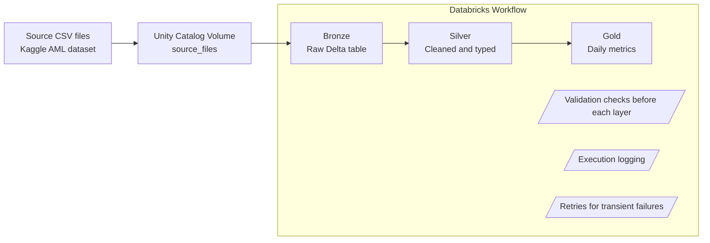

```mermaid
flowchart LR
    A[Source CSV files<br/>Kaggle AML dataset] --> B[Unity Catalog Volume<br/>source_files]
    subgraph W[Databricks Workflow]
        direction LR
        C[Bronze<br/>Raw Delta table] --> D[Silver<br/>Cleaned and typed] --> E[Gold<br/>Daily metrics]
        V[/Validation checks before each layer/]
        L[/Execution logging/]
        R[/Retries for transient failures/]
    end
    B --> C
```